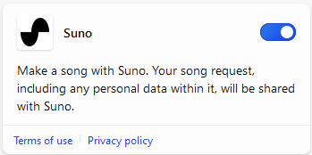

[Revenir à l’index](https://microsoftlearning.github.io/MS-4012-Microsoft-Copilot-Web-Based-Interactive-Experience-for-Executives/)

# Microsoft Copilot (sur le web)

## Copilot et grands modèles de langage

### Points de discussion

Microsoft Copilot sur le web vous offre un assistant personnel basé sur l’IA qui peut répondre aux questions et aider à effectuer des tâches générales. Je peux lui poser des questions, et il me donnera des réponses similaires à celles que n’importe quelle personne ayant fait des études supérieures pourrait me donner.

Lorsque vous ou votre organisation utilisez Copilot avec la protection des données commerciales, votre conversation n’est pas enregistrée. Toutes les données sont chiffrées et Microsoft ne conserve aucune de vos invites ou réponses. Elles ne sont pas utilisées pour former le modèle. Vous pouvez donc être certain que vos informations personnelles et organisationnelles resteront confidentielles.

Par exemple, je peux poser une question de connaissances générales comme celle-ci et obtenir en retour un grand nombre d’informations utiles. Vous pouvez considérer qu’il dispose d’un modèle conceptuel de base du monde qu’il peut utiliser pour répondre aux questions.

**Exemple :**
- **Invite :** Que peux-tu me dire sur les éléphants ?
- **Réponse :** (Discuter de la réponse)

Copilot utilise des grands modèles de langage (LLM) formés sur de grandes quantités d’informations, y compris les recherches et les résultats Bing. Mais Copilot n’est pas seulement un vérificateur de faits. Nous pouvons utiliser Copilot comme moteur de raisonnement général qui peut prendre vos questions et raisonner sur elles de manière stochastique. Dans le milieu, on parle d’inférence.

**Exemple :**
- **Invite :** Je suis plutôt intéressé par la puissance d’un éléphant. Combien d’humains faudrait-il pour gagner une épreuve de tir à la corde avec un éléphant ? REMARQUE : gardez à l’esprit la région et votre audience, car tout le monde ne connaît pas le terme « tir à la corde », que vous devrez donc modifier. 
- **Réponse :** (Discuter de la réponse)

Copilot a été capable de faire des suppositions et d’établir des liens entre des éléments de connaissance pour donner une réponse plus nuancée à ma question. Au fur et à mesure que nous améliorons Copilot, nous apprenons beaucoup de choses sur les points forts et les points faibles de ces grands modèles de langage, et nous intégrons ces connaissances dans le produit au fur et à mesure que nous le construisons.

### Étapes de la version de démonstration

> **REMARQUE :** si vous souhaitez utiliser vos propres invites, commencez par un sujet général qui vous intéresse ou qui intéresse votre client.

1. Basculez vers l’onglet Edge avec Copilot ouvert et le mode web sélectionné.

    

1. Dans la zone de texte **Demandez-moi ce que vous voulez…**, copiez et collez l’invite à partir des documents de la bibliothèque d’invites ou tapez :

    ```text
    What can you tell me about elephants?
    ```
1. Cliquez sur le bouton **Envoyer** .
1. Dans la zone de texte **Demandez-moi ce que vous voulez…**, copiez et collez l’invite :

    ```text
    I’m more interested in the power of an elephant. How many humans would it take to win a tug-of-war with an elephant?
    ```
1. Cliquez sur le bouton **Envoyer** .

## Mise à la terre

### Points de discussion

Mais ce qui fait passer cette capacité à un niveau supérieur, c’est la possibilité d’ancrer Copilot dans des données et des connaissances externes. C’est ce que l’on appelle parfois la Génération Augmentée de Récupération (RAG). Il s’agit du processus consistant à fournir au modèle de langage des informations supplémentaires pertinentes pour la tâche à accomplir.

Nous pouvons ancrer nos questions dans toutes sortes de données et de documents, par exemple le rapport sur l’emploi du bureau des statistiques du travail. Il s’agit d’un document volumineux, publié chaque année, qui regorge de données sur les emplois et les tendances de l’emploi aux États-Unis. Copilot est capable d’aller chercher ces informations, de les comprendre et de répondre à ma question en temps réel. Il me donne également des références qui m’indiquent où Copilot a obtenu ces informations, par exemple sur le site web du bureau des statistiques du travail. Cela signifie que je peux vérifier où Copilot a obtenu ses informations et obtenir plus de contexte, car il s’agit de Copilot, pas d’un pilote automatique.

### Étapes de la version de démonstration

1. Commencez un nouveau sujet en cliquant sur **Nouveau sujet**.

    

1. Dans la zone de texte **Demandez-moi ce que vous voulez…**, copiez et collez l’invite :

    ```text
    Can you give me a list of the labor force participation rates from the Bureau of Labor Statistics over the last 5 years?
    ```
1. Cliquez sur le bouton **Envoyer** .
1. Dans la réponse, en regard de **En savoir plus**, passez la souris sur une ou deux références.

## Compétences supplémentaires de Copilot

### Points de discussion

C’est génial, mais j’aimerais vraiment voir un graphique de ces données. Malheureusement, Copilot ne peut pas dessiner un graphique pour l’instant, mais cela ne signifie pas que nous sommes bloqués. À mesure que nous développons Copilot, nous ajoutons différentes compétences. Les compétences sont des moyens par lesquels Copilot peut tirer parti de son pouvoir de raisonnement pour résoudre des problèmes.

Je sais que Copilot a également la capacité de coder. Je vais rappeler à Copilot qu’il sait coder et voir si je peux lui faire écrire le code Python pour le graphique que je voulais.

**Exemple :**
- **Invite :** Peux-tu me donner une liste des taux de participation de la main-d’œuvre du bureau des statistiques du travail au cours des 5 dernières années ? J’ai également entendu dire que tu pouvais coder. Peux-tu récupérer les données sur bls.gov, puis écrire le code Python qui produirait le graphique que je recherche ?
- **Réponse :** (Discuter de la réponse)

Au fil du temps, nous nous attendons à ce que ces types de processus deviennent plus faciles et plus automatisés.

### Étapes de la version de démonstration

1. Commencez un nouveau sujet en cliquant sur **Nouveau sujet**.

    

1. Dans la zone de texte **Demandez-moi ce que vous voulez…**, copiez et collez l’invite :

    ```text
    Can you give me a list of the labor force participation rates from the Bureau of Labor Statistics over the last 5 years? I also heard that you could code. Can you grab the data from bls.gov and then write the Python code that would produce the graph I'm looking for?
    ```

1. Cliquez sur le bouton **Envoyer** .

## Étapes facultatives de la démonstration

### Reconnaissance d’images

Commencez par télécharger l’élément suivant : [**Qu’est-ce que cette image.png**](https://github.com/MicrosoftLearning/MS-4012-Microsoft-Copilot-Unlocked/raw/master/Resourcefiles/what_is_this_image.PNG)

1. Commencez un nouveau sujet en cliquant sur **Nouveau sujet**.

    

1. En bas de la page, sélectionnez l’icône **Ajouter une image**.

    

1. Sélectionnez **Charger à partir de cet appareil**.
1. Accédez à l’emplacement où vous avez téléchargé l’image, sélectionnez **Qu’est-ce que cette picture.png**, puis sélectionnez **Ouvrir**.
1. Dans la zone de texte **Demandez-moi ce que vous voulez…**, entrez l’invite  :

    ```text
    What is this picture?
    ```

1. Cliquez sur le bouton **Envoyer** .

### Montrer comment Copilot peut créer des images

1. Dans la zone de texte **Demandez-moi ce que vous voulez…**, copiez et collez l’invite :

    ```text
    Copilot, make a banner for a hamburger stand. Make it friendly and show people enjoying a hamburger.
    ```

1. Cliquez sur le bouton **Envoyer** .

### Montrer comment Copilot peut écrire une chanson

1. Basculez vers une nouvelle session de navigateur connectée à un compte personnel.

> **REMARQUE :** vous devez utiliser un compte personnel pour cette étape. Les comptes professionnels ne fonctionneront pas.

1. Dans le coin supérieur droit, sélectionnez **Plug-ins**.

    

1. Dans la liste des plug-ins disponibles, activez **Suno**.

    

    > **REMARQUE :** pour utiliser Suno, vous devez commencer un nouveau sujet dans Copilot, puis activer Suno.

1. Dans la zone de texte **Demandez-moi ce que vous voulez…**, copiez et collez l’invite :

    ```text
    Write a country song about Microsoft Copilot, extolling its virtues as an AI companion. Make it catchy, upbeat, and a little quirky.
    ```

1. Cliquez sur le bouton **Envoyer** .

[Revenir à l’index](https://microsoftlearning.github.io/MS-4012-Microsoft-Copilot-Web-Based-Interactive-Experience-for-Executives/)
